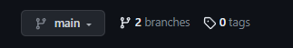
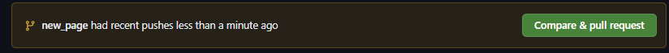

# Github Pages

## What are Github Pages?
Github Pages use a special repository in your github profile which serves as a website. You can find this website at \<your user name\>.github.io

We are going to use it to create a very basic landing page for our portfolio. This way we can get started on your ability to showcase your work! We need people know you are putting in the work!

## Getting started

Click on the following guide to get started on your github.io website: [Getting Started](https://docs.github.com/en/pages/quickstart).

This will let us at least get started.

Go to the _config.yml file. This is kind of like the settings for your website. For now, change the `title` to your name.

## First Branch

We are going to practice branching our github.io website and building out a feature.

Go to the repository page for your website and click on the "branches".

Click on the New branch button on the top right.

Click on the new branch you made to go to it. It should look exactly the same as your main branch. 

Go to the html folder in this week's class folder. We are going to add that page to our github.

## Adding an index.html to branch

We're going to fill out the index page based on the instructions in the HTML. 

Once you complete that come back here. Since we are not a web development course, we're not going to dive into how HTML works or how to make it super fancy but we'll at least get you going with an index page. 

This way you have something to upload!

## Making Pull Request

Once you are done with the `index.html` file, go upload the file to your repository on github. 

Use the `add file` button in order to add this to your repository. Make sure you are commiting immediately to the branch without making a new one.

Then go back to your main branch by selecting the main branch on the top left.

You should see something like this pop up: 

Click compare and pull request. 

Follow the instructions and buttons to make the pull and merge request.

Once you complete the merge request, make sure you delete the branch.